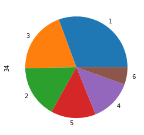

```python
# Author : Amir Shokri
# github link : https://github.com/amirshnll/dermatology
# dataset link : http://archive.ics.uci.edu/ml/datasets/Dermatology
# email : amirsh.nll@gmail.com
```


```python
import pandas as pd
from sklearn.preprocessing import MinMaxScaler
from sklearn.decomposition import PCA
from sklearn.model_selection import train_test_split
from sklearn.metrics import f1_score
from sklearn.metrics import accuracy_score
```


```python
data = pd.read_csv('dermatology_data.csv', header=None)
```


```python
data = data.replace(to_replace="?", method='ffill')
```


```python
data.describe()
```


<div>
<style scoped>
    .dataframe tbody tr th:only-of-type {
        vertical-align: middle;
    }

    .dataframe tbody tr th {
        vertical-align: top;
    }

    .dataframe thead th {
        text-align: right;
    }
</style>
<table border="1" class="dataframe">
  <thead>
    <tr style="text-align: right;">
      <th></th>
      <th>0</th>
      <th>1</th>
      <th>2</th>
      <th>3</th>
      <th>4</th>
      <th>5</th>
      <th>6</th>
      <th>7</th>
      <th>8</th>
      <th>9</th>
      <th>...</th>
      <th>24</th>
      <th>25</th>
      <th>26</th>
      <th>27</th>
      <th>28</th>
      <th>29</th>
      <th>30</th>
      <th>31</th>
      <th>32</th>
      <th>34</th>
    </tr>
  </thead>
  <tbody>
    <tr>
      <th>count</th>
      <td>366.000000</td>
      <td>366.000000</td>
      <td>366.000000</td>
      <td>366.000000</td>
      <td>366.000000</td>
      <td>366.000000</td>
      <td>366.000000</td>
      <td>366.000000</td>
      <td>366.000000</td>
      <td>366.000000</td>
      <td>...</td>
      <td>366.000000</td>
      <td>366.000000</td>
      <td>366.000000</td>
      <td>366.000000</td>
      <td>366.000000</td>
      <td>366.000000</td>
      <td>366.000000</td>
      <td>366.000000</td>
      <td>366.000000</td>
      <td>366.000000</td>
    </tr>
    <tr>
      <th>mean</th>
      <td>2.068306</td>
      <td>1.795082</td>
      <td>1.549180</td>
      <td>1.366120</td>
      <td>0.633880</td>
      <td>0.448087</td>
      <td>0.166667</td>
      <td>0.377049</td>
      <td>0.614754</td>
      <td>0.519126</td>
      <td>...</td>
      <td>0.393443</td>
      <td>0.464481</td>
      <td>0.456284</td>
      <td>0.953552</td>
      <td>0.453552</td>
      <td>0.103825</td>
      <td>0.114754</td>
      <td>1.866120</td>
      <td>0.554645</td>
      <td>2.803279</td>
    </tr>
    <tr>
      <th>std</th>
      <td>0.664753</td>
      <td>0.701527</td>
      <td>0.907525</td>
      <td>1.138299</td>
      <td>0.908016</td>
      <td>0.957327</td>
      <td>0.570588</td>
      <td>0.834147</td>
      <td>0.982979</td>
      <td>0.905639</td>
      <td>...</td>
      <td>0.849406</td>
      <td>0.864899</td>
      <td>0.954873</td>
      <td>1.130172</td>
      <td>0.954744</td>
      <td>0.450433</td>
      <td>0.488723</td>
      <td>0.726108</td>
      <td>1.105908</td>
      <td>1.597803</td>
    </tr>
    <tr>
      <th>min</th>
      <td>0.000000</td>
      <td>0.000000</td>
      <td>0.000000</td>
      <td>0.000000</td>
      <td>0.000000</td>
      <td>0.000000</td>
      <td>0.000000</td>
      <td>0.000000</td>
      <td>0.000000</td>
      <td>0.000000</td>
      <td>...</td>
      <td>0.000000</td>
      <td>0.000000</td>
      <td>0.000000</td>
      <td>0.000000</td>
      <td>0.000000</td>
      <td>0.000000</td>
      <td>0.000000</td>
      <td>0.000000</td>
      <td>0.000000</td>
      <td>1.000000</td>
    </tr>
    <tr>
      <th>25%</th>
      <td>2.000000</td>
      <td>1.000000</td>
      <td>1.000000</td>
      <td>0.000000</td>
      <td>0.000000</td>
      <td>0.000000</td>
      <td>0.000000</td>
      <td>0.000000</td>
      <td>0.000000</td>
      <td>0.000000</td>
      <td>...</td>
      <td>0.000000</td>
      <td>0.000000</td>
      <td>0.000000</td>
      <td>0.000000</td>
      <td>0.000000</td>
      <td>0.000000</td>
      <td>0.000000</td>
      <td>1.000000</td>
      <td>0.000000</td>
      <td>1.000000</td>
    </tr>
    <tr>
      <th>50%</th>
      <td>2.000000</td>
      <td>2.000000</td>
      <td>2.000000</td>
      <td>1.000000</td>
      <td>0.000000</td>
      <td>0.000000</td>
      <td>0.000000</td>
      <td>0.000000</td>
      <td>0.000000</td>
      <td>0.000000</td>
      <td>...</td>
      <td>0.000000</td>
      <td>0.000000</td>
      <td>0.000000</td>
      <td>0.000000</td>
      <td>0.000000</td>
      <td>0.000000</td>
      <td>0.000000</td>
      <td>2.000000</td>
      <td>0.000000</td>
      <td>3.000000</td>
    </tr>
    <tr>
      <th>75%</th>
      <td>2.000000</td>
      <td>2.000000</td>
      <td>2.000000</td>
      <td>2.000000</td>
      <td>1.000000</td>
      <td>0.000000</td>
      <td>0.000000</td>
      <td>0.000000</td>
      <td>1.000000</td>
      <td>1.000000</td>
      <td>...</td>
      <td>0.000000</td>
      <td>1.000000</td>
      <td>0.000000</td>
      <td>2.000000</td>
      <td>0.000000</td>
      <td>0.000000</td>
      <td>0.000000</td>
      <td>2.000000</td>
      <td>0.000000</td>
      <td>4.000000</td>
    </tr>
    <tr>
      <th>max</th>
      <td>3.000000</td>
      <td>3.000000</td>
      <td>3.000000</td>
      <td>3.000000</td>
      <td>3.000000</td>
      <td>3.000000</td>
      <td>3.000000</td>
      <td>3.000000</td>
      <td>3.000000</td>
      <td>3.000000</td>
      <td>...</td>
      <td>3.000000</td>
      <td>3.000000</td>
      <td>3.000000</td>
      <td>3.000000</td>
      <td>3.000000</td>
      <td>3.000000</td>
      <td>3.000000</td>
      <td>3.000000</td>
      <td>3.000000</td>
      <td>6.000000</td>
    </tr>
  </tbody>
</table>
<p>8 rows × 34 columns</p>
</div>


```python
properties = data[data.columns[:34]]
target = data[data.columns[34]]
scaler = MinMaxScaler()
scaled_x = scaler.fit_transform(properties)

```


```python
target.value_counts().plot.pie()
```


    <matplotlib.axes._subplots.AxesSubplot at 0x23b944ca7f0>





```python
pca = PCA(n_components=15)
reduced_x = pca.fit_transform(scaled_x)
```


```python
X_train, X_test, y_train, y_test = train_test_split(reduced_x, target, test_size=0.3, random_state=0)
```


```python
from sklearn.naive_bayes import GaussianNB
from sklearn.neural_network import MLPClassifier
from sklearn.neighbors import KNeighborsClassifier
from sklearn.tree import DecisionTreeClassifier
from sklearn.linear_model import LogisticRegression
```


```python
gnb = GaussianNB()
mlp = MLPClassifier(hidden_layer_sizes=(100, 100))
knn = KNeighborsClassifier(n_neighbors=5)
dt = DecisionTreeClassifier()
regressor = LogisticRegression()
```


```python
gnb.fit(X_train, y_train)
y_predgnb = gnb.predict(X_test)

mlp.fit(X_train, y_train)
y_predmlp = mlp.predict(X_test)

knn.fit(X_train, y_train)
y_predknn = knn.predict(X_test)

dt.fit(X_train, y_train)
y_preddt = dt.predict(X_test)

regressor.fit(X_train, y_train)
y_predregressor = regressor.predict(X_test)
```

    C:\Users\Amirshnll\anaconda3\lib\site-packages\sklearn\neural_network\_multilayer_perceptron.py:582: ConvergenceWarning: Stochastic Optimizer: Maximum iterations (200) reached and the optimization hasn't converged yet.
      warnings.warn(
    


```python
print('gnb f1: ', f1_score(y_test, y_predgnb, average='micro'))
print('gnb accuracy: ', accuracy_score(y_test, y_predgnb))

print('mlp f1: ', f1_score(y_test, y_predmlp, average='micro'))
print('mlp accuracy: ', accuracy_score(y_test, y_predmlp))

print('knn f1: ', f1_score(y_test, y_predgnb, average='micro'))
print('knn accuracy: ', accuracy_score(y_test, y_predknn))

print('decision tree f1: ', f1_score(y_test, y_predgnb, average='micro'))
print('decision tree accuracy: ', accuracy_score(y_test, y_preddt))

print('logistic regression f1: ', f1_score(y_test, y_predgnb, average='micro'))
print('logistic regression accuracy: ', accuracy_score(y_test, y_predregressor))
```

    gnb f1:  0.9727272727272728
    gnb accuracy:  0.9727272727272728
    mlp f1:  1.0
    mlp accuracy:  1.0
    knn f1:  0.9727272727272728
    knn accuracy:  0.9818181818181818
    decision tree f1:  0.9727272727272728
    decision tree accuracy:  0.9090909090909091
    logistic regression f1:  0.9727272727272728
    logistic regression accuracy:  0.990909090909091
    
